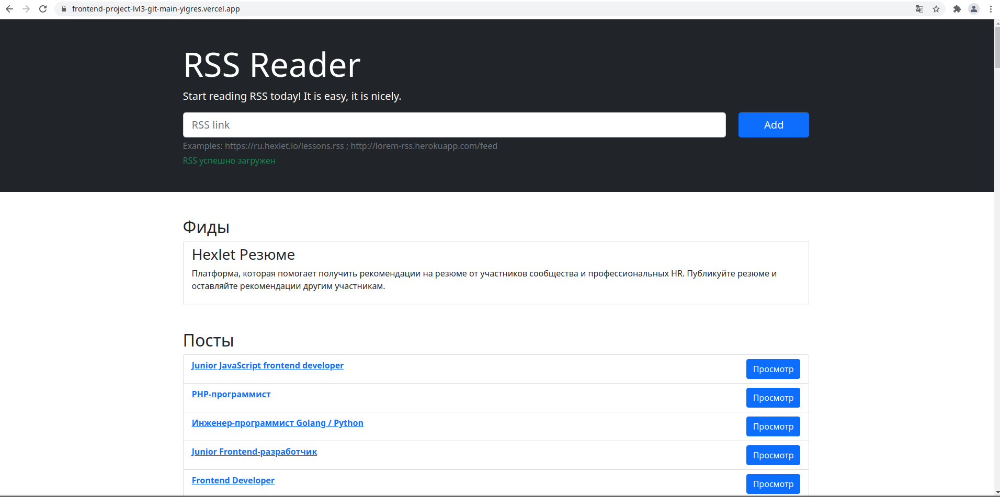

# RSS Feed Reader  
Rss Reader is a service for aggregating RSS feeds, with the help of which it is convenient to read various sources, for example, blogs. It allows you to add an unlimited number of RSS feeds, updates them and adds new entries to the general stream.  

[Go to aggregator](https://frontend-project-lvl3-git-main.yigres.vercel.app/)
